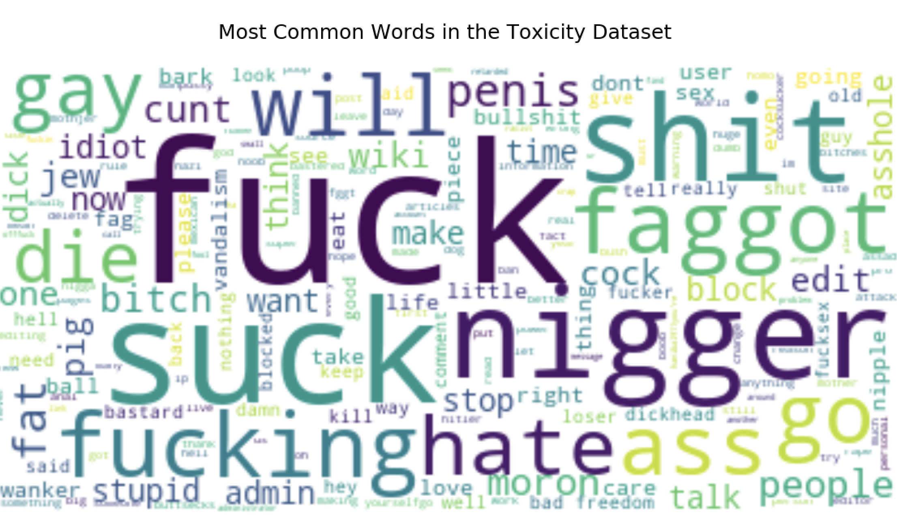

# A2 DATA INTERROGATION - BIAS IN DATA

## Objective
Identify potential sources of bias in a corpus of human-annotated data, and describe some implications of those biases. The Wikipedia Talk corpus is used and it consists of three datasets. Each dataset contains thousands of online discussion posts made by Wikipedia editors who were discussing how to write and edit Wikipedia articles. Crowdworkers labelled these posts for three kinds of hostile speech: “toxicity”, “aggression”, and “personal attacks”. The current analysis focuses on the "toxicity" and "personal attacks" dataset.

Analyses are performed to identify if there is a suitable representations of population groups in the labellers sample, if certain demographics are unfairly marginalized due to the labelling, and exploration of time trends of word usage. Initial investigation reveals some of the most common 'toxic' labels as follows: 

Exploration of how the bias might impact the behavior of machine learning models trained on the data, when those models are used for research purposes or to power data-driven applications is also performed. For example, Google used these datasets to train a project called [Conversation AI](https://github.com/conversationai/perspectiveapi)

## Data Sources

The data is downloaded from [Figshare](https://figshare.com/projects/Wikipedia_Talk/16731). View schema and further dataset informatin [here](https://meta.wikimedia.org/wiki/Research:Detox/Data_Release).

For further information of the data collection processing and labelling protocol, read this [reference paper](https://arxiv.org/abs/1610.08914)

## License

The data sources are available for use under the [CC0 public domain license](https://wiki.creativecommons.org/wiki/CC0) and the project repository is available under the [MIT License](LICENSE)

